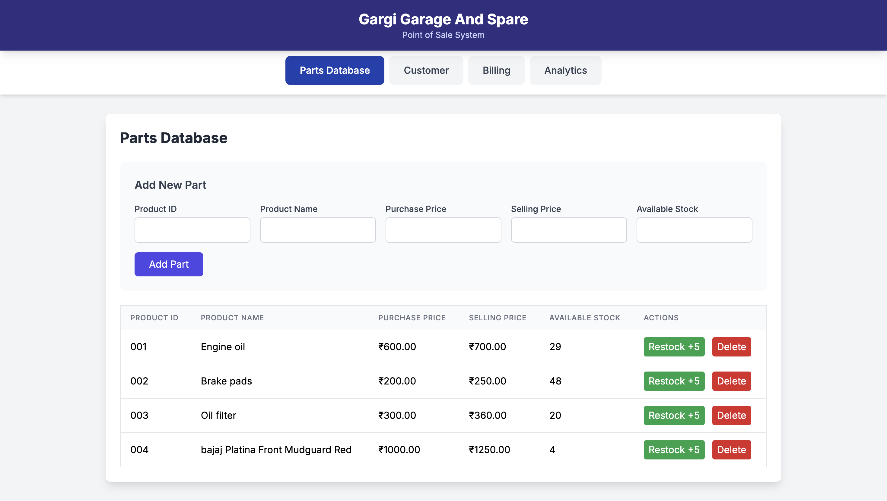
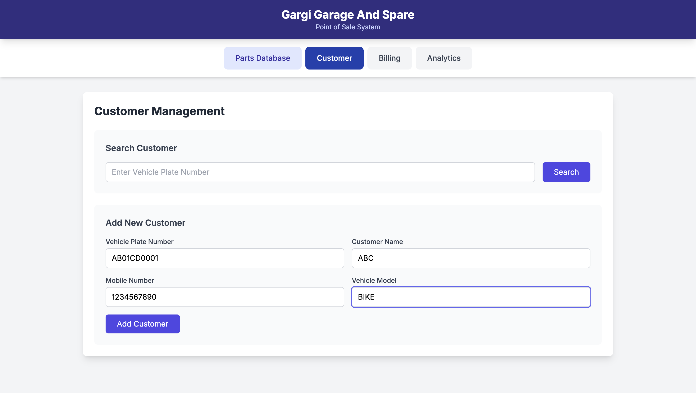
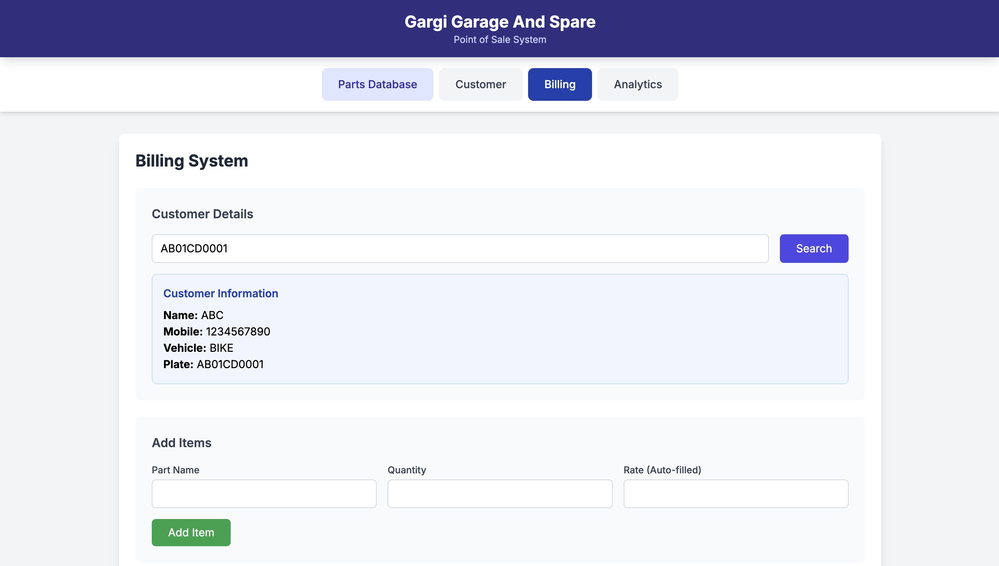
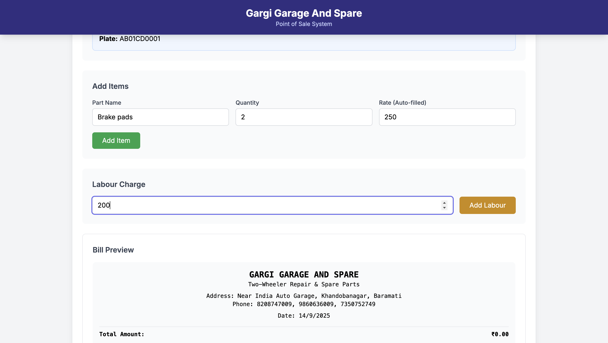
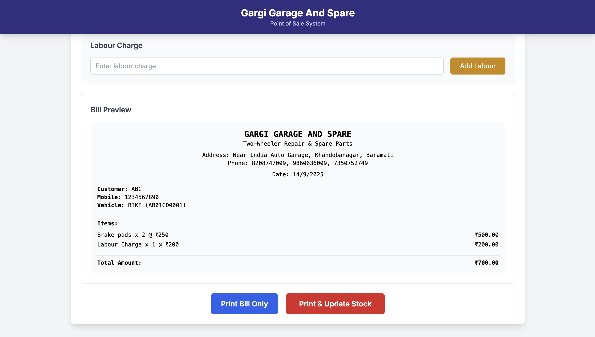
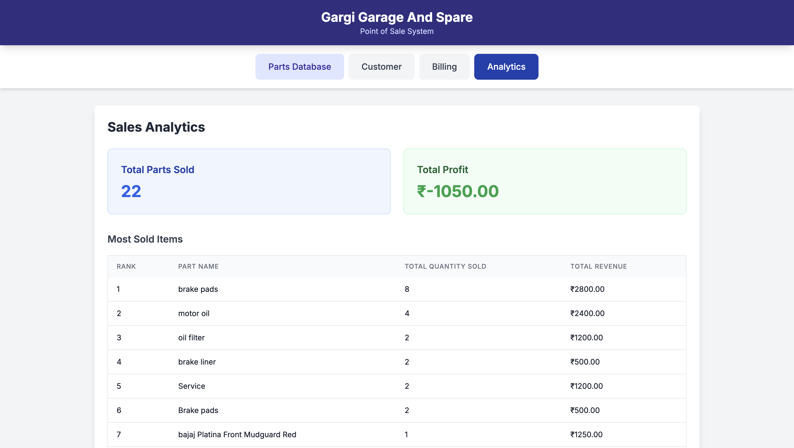

# Gargi Garage And Spare - POS System

A simple web-based Point of Sale (POS) system for managing parts, customers, and billing for a two-wheeler garage and spare parts shop.

## Features

* **Parts Database:** Add, view, and manage an inventory of spare parts, including purchase price, selling price, and stock levels.
  
  
* **Customer Management:** Search and add customer details associated with their vehicle's plate number.
    

* **Billing System:** Create bills for customers, add multiple parts and labour charges, and generate a printable bill.
  
  
  

* **Sales Analytics:** View key metrics such as total parts sold, total profit, and a list of most sold items.
    

* **Data Management:** Export and import a backup of all data (parts, customers, sales).


## Technologies Used

* **Frontend:** HTML, Tailwind CSS (via CDN), JavaScript
* **Backend:** Python with Flask
* **Database:** JSON file-based storage (`garage_data.json`) for simplicity.

## Setup and Installation

### Prerequisites

* Python 3.x
* `pip` (Python package installer)

### Steps

1.  **Clone the repository:**
    ```bash
    git clone https://github.com/ULTRASIRI/POS-system-for-Gargi-Garage.git
    ```

2.  **Create and activate a virtual environment:**
    It's a best practice to use a virtual environment to manage dependencies.
    ```bash
    # On macOS/Linux
    python3 -m venv venv
    source venv/bin/activate

    # On Windows
    python -m venv venv
    venv\Scripts\activate
    ```

3.  **Install dependencies:**
    The project uses Flask. You can install it using `pip`.
    ```bash
    pip install Flask
    ```

4.  **Run the application:**
    ```bash
    python app.py
    ```

5.  **Access the application:**
    Open your web browser and navigate to `http://127.0.0.1:5000`.

## Project Structure

```
/
gargi-garage/
│── app.py              # Flask backend
│── garage.db           # Auto-created SQLite database
│── templates/
│    └── index.html     # Frontend (served by Flask)
│── static/
     └── script.js      # JavaScript for frontend
```

## Contributing

Pull requests are welcome. For major changes, please open an issue first to discuss what you would like to change.

## License

This project is licensed under the Apache License 2.0. See the `LICENSE` file for details.

---

**Note:** This is a basic system and does not use a real database, so data will be stored in a local JSON file. This is suitable for a single-user, local setup but is not recommended for a production environment.
